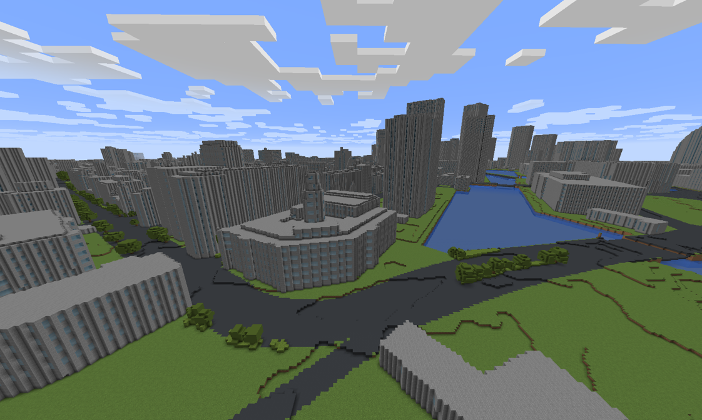
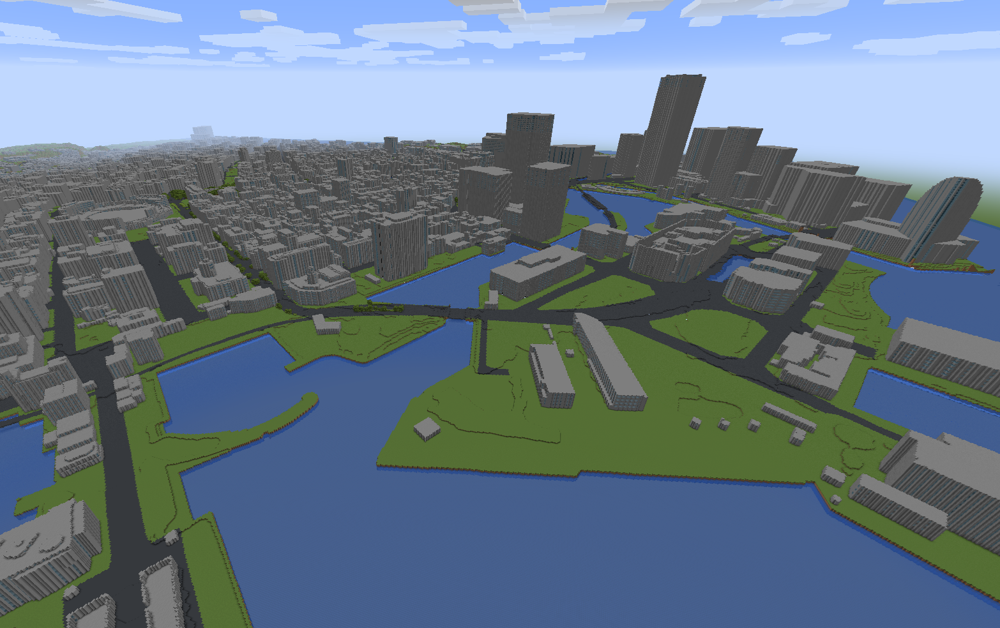
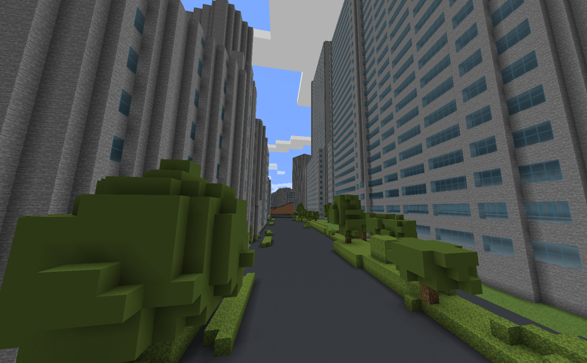
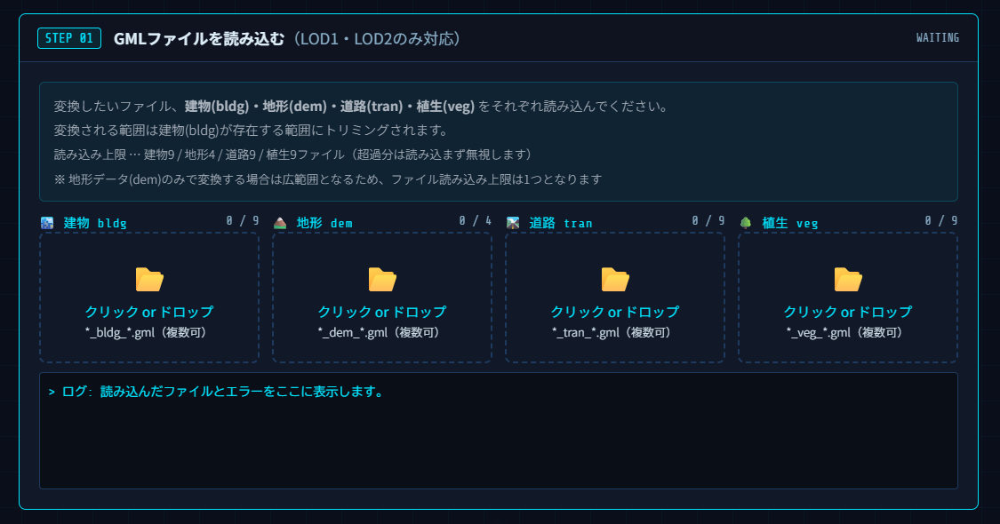
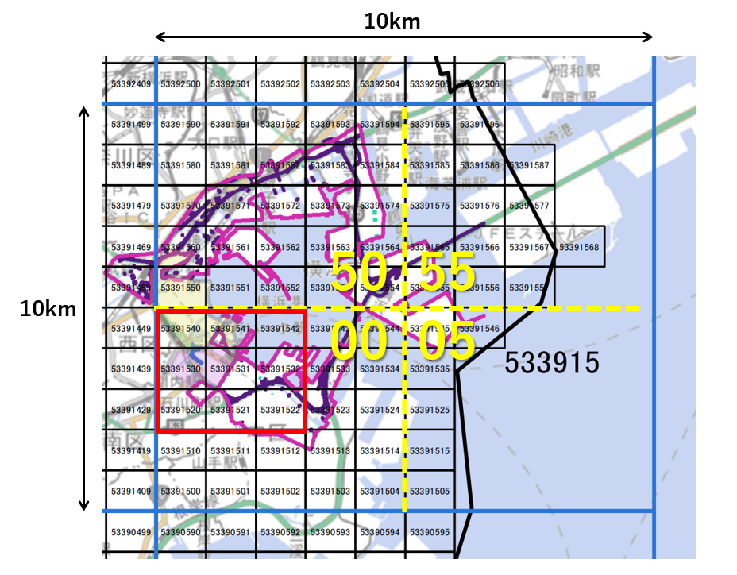
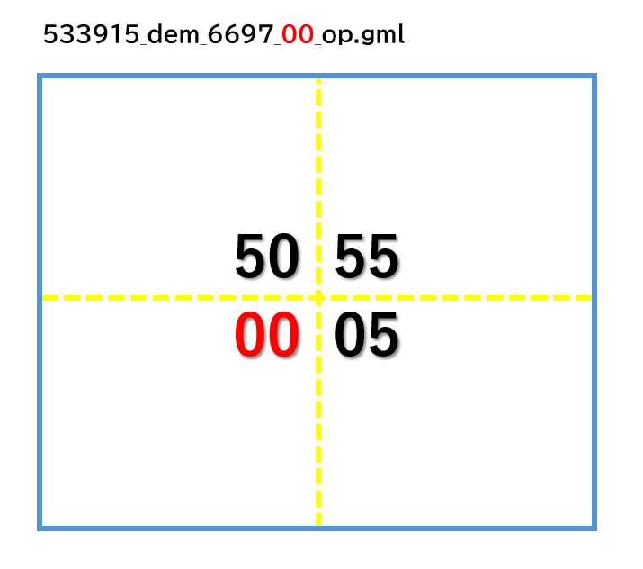
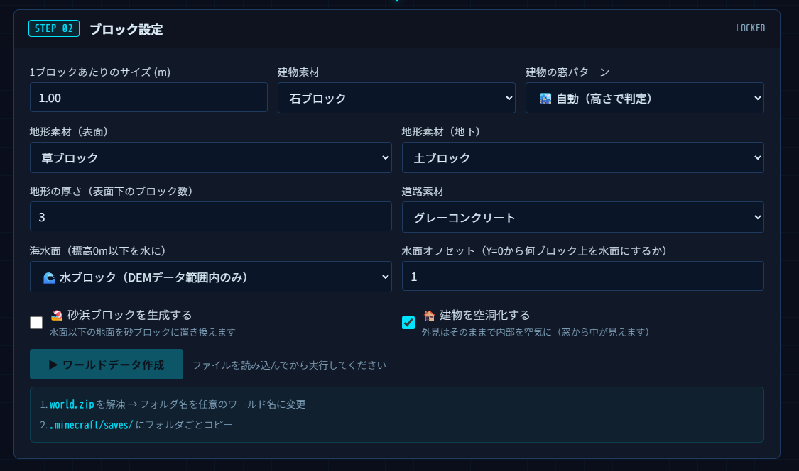
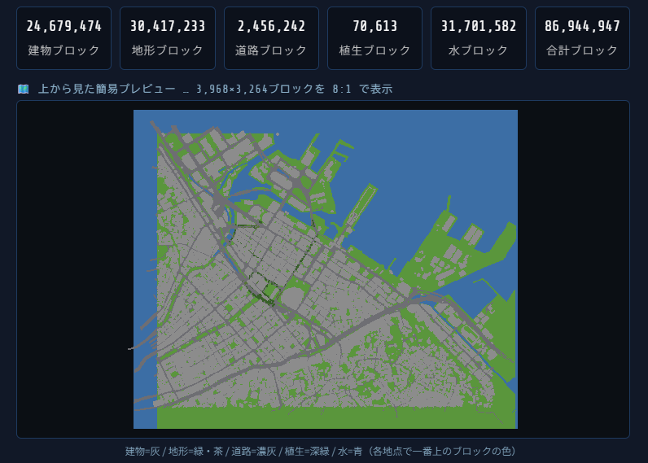

# PLATEAU_to_Minecraft 一発変換

**Ver 1.0**　© 2026 kauji

**ツールを使う：** https://kaujisoft.github.io/plateau_to_minecraft/

国土交通省「PLATEAU（プラトー）」が公開している 3D 都市データ（CityGML 形式の GML ファイル）を読み込み、Minecraft（Java 版）でそのまま遊べるワールドデータに一発変換するブラウザアプリです。
インストール不要。ブラウザだけで動作します。

ツールの詳しい使い方は[操作説明書（PDF）](plateau_minecraft_ver.1.0.pdf)を参照してください。

---

## 変換例（横浜市中区）

 

---

## 特長

- **インストール不要** — Web ブラウザを開くだけで使えます。Python 等の知識は不要です。
- **完全ローカル処理** — 読み込んだファイルはインターネットに送信されません。変換はすべてお使いのパソコン内で完結します。
- **4 種類のデータを一括変換** — 建物・地形・道路・植生（並木や緑地）をまとめて 1 つのワールドに変換できます。
- **素材・外観のカスタマイズ** — 建物・地形・道路のブロック素材や、建物の窓パターンを選択できます。
- **海の再現** — 標高 0m 以下を海として疑似的に再現できます（海面の高さ調整可能）。
- **LOD1 / LOD2 対応** — 両形式の建物データを自動判別して適用します。

---

## 必要なもの

| 項目 | 内容 |
|---|---|
| ブラウザ | Chrome または Edge 最新版を推奨 |
| PLATEAUデータ | 国土交通省 CityGML データ（<a href="https://www.mlit.go.jp/plateau/open-data/">ダウンロードはこちら</a>） |
| Minecraft | Java 版（変換後のワールドでプレイする場合） |

---

## 使い方

### STEP 01 — GML ファイルを読み込む

建物（bldg）・地形（dem）・道路（tran）・植生（veg）の 4 種類の GML ファイルをそれぞれの枠にドロップ（またはクリックして選択）します。

**読み込みの手順**

1. 最初に「建物 bldg」の枠へ建物の GML ファイルをドロップします（複数ファイル可）。
2. 建物が読み込まれたら、地形・道路・植生の枠に対応するファイルを入れます。
3. 画面の数値（建物数・ポリゴン数・エリア等）を確認して STEP 02 へ進みます。

⚠️ **必ず建物（bldg）を最初に読み込んでください。** 本アプリは建物のエリアで地形をトリミングする仕様のため、先に建物を読み込む必要があります。

**読み込めるファイル数の上限**

| 種類 | 上限 |
|---|---|
| 建物（bldg） | 9 ファイル |
| 地形（dem） | 4 ファイル（建物なしの場合は 1） |
| 道路（tran） | 9 ファイル |
| 植生（veg） | 9 ファイル |

---

### STEP 01 補足 — どのファイルを選ぶか

PLATEAUデータをダウンロードすると、`udx` フォルダ以下に種類ごとのフォルダが入っています。変換したいエリアに対応するファイルを `bldg` / `dem` / `tran` / `veg` フォルダからそれぞれ選んでください。

**① 変換したいエリアのメッシュ番号を確認する**

PLATEAUのダウンロード ZIP に含まれるインデックス図（例：`14100_indexmap_op.pdf`）を開き、変換したいエリアが含まれるメッシュ番号を確認します。

*インデックス図の例（横浜市）。赤枠のエリアを変換する場合、含まれるメッシュ番号（53391520〜53391542 等）のファイルを選びます。*

**② 地形（dem）ファイルの分割に注意する**

地形ファイルは 100km² と非常に大きいため、地区によっては 4 分割されています。ファイル名末尾の `00` / `05` / `50` / `55` がどの象限かを示しており、変換したいエリアが含まれる象限のファイルを選んでください。

*例：変換エリアが左下（`00`）にある場合は `533915_dem_6697_00_op.gml` を選択。*

---

### STEP 02 — ブロック設定と変換

ファイルの読み込みが完了したら、ブロックの素材やサイズを設定して「ワールドデータ作成」ボタンを押します。

**主な設定項目**

| 設定項目 | 初期値 | 説明 |
|---|---|---|
| 1 ブロックあたりのサイズ | 1.00 m | 小さいほど精細。0.5m 刻みで 0.5〜10.0m |
| 建物素材 | 石ブロック | 石・砂岩・レンガ・白コンクリート等から選択 |
| 建物の窓パターン | 自動（高さで判定） | なし・自動・オフィス窓・グリッド窓・縦ストライプ |
| 地形素材（表面） | 草ブロック | 草・土・砂・石 |
| 道路素材 | グレーコンクリート | 黒コン・グレーコン・石・砂利・丸石 |
| 海水面 | 水ブロック | なし・水ブロック・氷ブロック |
| 建物を空洞化する | オン | 外見はそのまま、内部を空気にしてフロアを生成 |

> よくわからない場合はデフォルト設定のまま「ワールドデータ作成」を押してみてください。

変換が完了すると、**ブロック数の集計とマッププレビュー**が表示され、`world.zip` が自動でダウンロードされます。

*マッププレビューの色：灰＝建物 / 緑・茶＝地形 / 濃い灰＝道路 / 深い緑＝植生 / 青＝水*

---

### Minecraft への取り込み

1. ダウンロードした `world.zip` を解凍すると `world` フォルダができます。
2. フォルダ名を好きなワールド名に変更します（例：`plateau_yokohama`）。
3. `%appdata%\.minecraft\saves` を開き、フォルダごとコピーします。
4. Minecraft Java 版を起動し、「シングルプレイ」から追加したワールドを選択します。

初回起動時にアップグレード確認ダイアログが出ますが「危険性を理解したうえで読み込む」→「はい」を選択してください。

---

## よくある質問

| 症状・メッセージ | 対処方法 |
|---|---|
| ファイルを入れても読み込まれない／枠が赤くなる | ファイルの種類（bldg/dem/tran/veg）と枠が合っているか確認。PLATEAU の CityGML（.gml）か確認してください。 |
| 「座標が見つかりません」と出る | ファイルが壊れているか対象外の形式の可能性があります。別のファイルで試してください。 |
| 地形が空になる | 建物 GML を先に読み込んでから地形ファイルを入れてください。 |
| 「三角形数が上限に達した」と出る | 範囲が広すぎます。地形ファイルを減らすか、先に建物を読み込んで範囲を絞ってください。 |
| 変換が重い・固まる | 「1 ブロックあたりのサイズ」を大きくする、ファイル数を減らす、窓パターンを「なし」にするなどで軽くなります。 |
| 海岸線がうまく再現できない | ブロックサイズ「1.00m」より大きくすると海岸線がずれる場合があります。 |

---

## 注意事項

- 本アプリは Minecraft Java 版 **1.20** での動作を確認しています。
- 変換中はブラウザのタブを閉じたり、別の重い作業をしたりしないでください。
- 地形（dem）ファイルが 1 ファイルで 500MB を超える場合、読み込めない場合があります。
- 間違って読み込んだ場合は F5 キーを押してページを再読み込みしてください。
- Minecraft は Mojang Studios の商標です。PLATEAU は国土交通省が主導するプロジェクトです。

---

## 利用条件

- ソースコードおよび関連ドキュメントの著作権は開発者に帰属します。
- ファイルの転載・販売、および第三者がダウンロード・閲覧できる場所への公開を禁止します。
- 本アプリの利用によって生じたいかなる損害についても、開発者は責任を負いません。
- 本アプリで生成したワールドデータを公開・配布・二次利用する際は、PLATEAUおよび元データの利用規約・ライセンスに従ってください。

---

## 更新履歴

| バージョン | 日付 | 内容 |
|---|---|---|
| Ver 1.0 | 2026.6.27 | リリース |

---

## Special Thanks

- おっさんB

---

